import { Tabs, TabItem } from '@astrojs/starlight/components';

## 系統支援度
- 可使用的系統
    - Windows
    - Linux
    - Android
    - iOS
- 不可使用的系統
    - macOS

## **⬇️請選擇你的系統⬇️**
<Tabs>
    <TabItem label="Windows" icon="seti:windows">
    ## Windows
    - for IA32/AMD64/arm64
    1. 下載各校設定檔 [API](https://download.isli.me/) [GitHub](https://github.com/eduroamtw/geteduroam_tw/tree/main/Profile)
    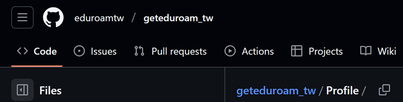
    2. 下載 geteduroam 主程式 [點我](https://www.eduroam.app)
    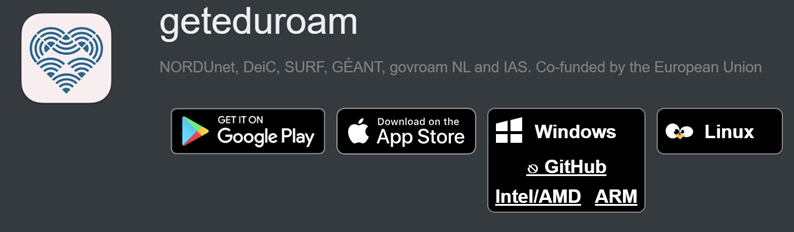
    3. 新增一個資料夾，名稱任意。
    4. 將剛剛下載的設定檔與 geteduroam 主程式放進去剛才新增的資料夾。
    5. 打開 geteduroam 主程式。
    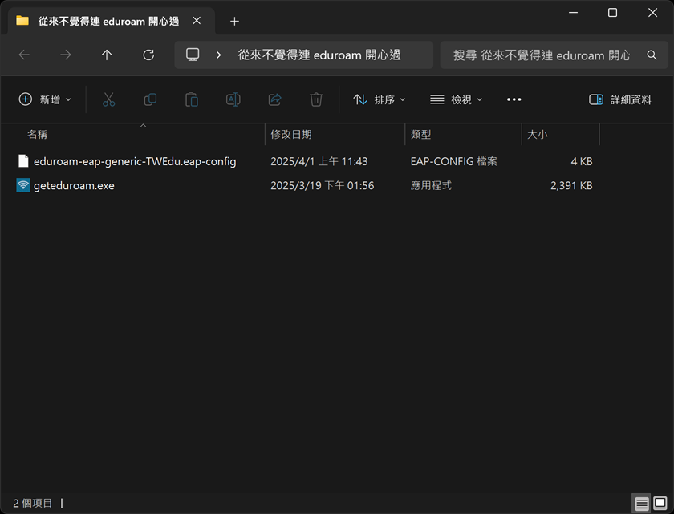
    6. 確認設定檔資訊後，按 Next
    
    > 如果跳出附圖的畫面，則依序點選 
    > Install
    > 是
    > Next
    > 資安警告：請勿安裝任何未知來源的設定檔。
    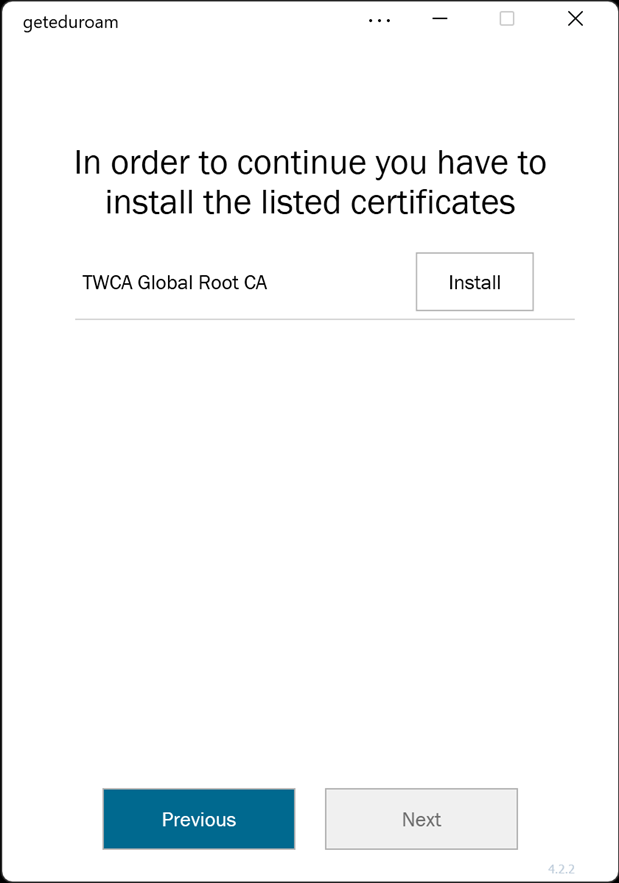
    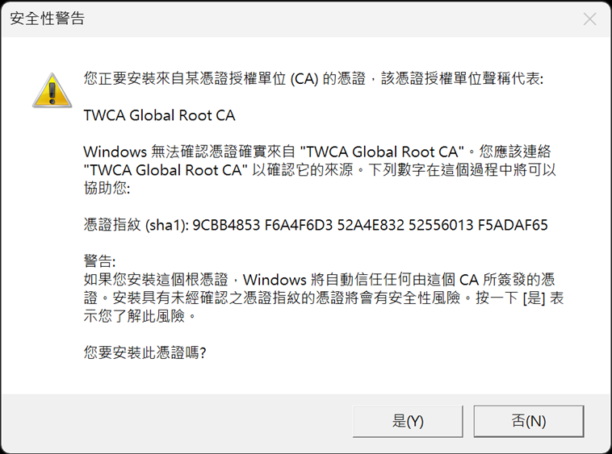
    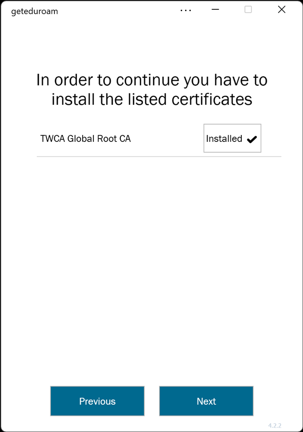
    7. 輸入你單位帳密
    8. 按 Connect
    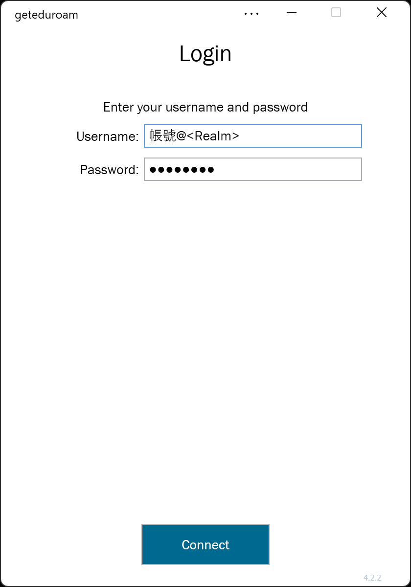
    9. 出現 Everything is set up correctly! 後，就可以快樂上網了。
    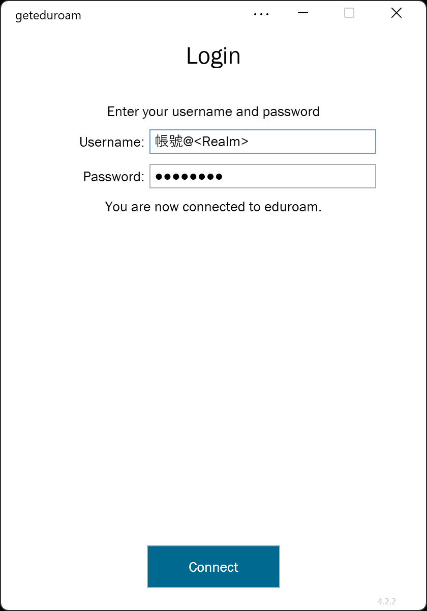

    </TabItem>
    <TabItem label="🤖 Android">
    ## Android
    0. 下載設定檔
    1. 下載 geteduroam 程式
    2. 打開他
    
    3. 長按右上搜尋鍵
    4. 點選 Open .eapconfig file
    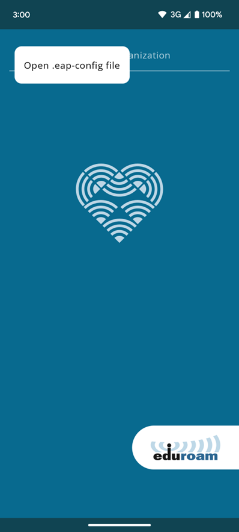
    5. 打開剛剛下載的設定檔檔案
    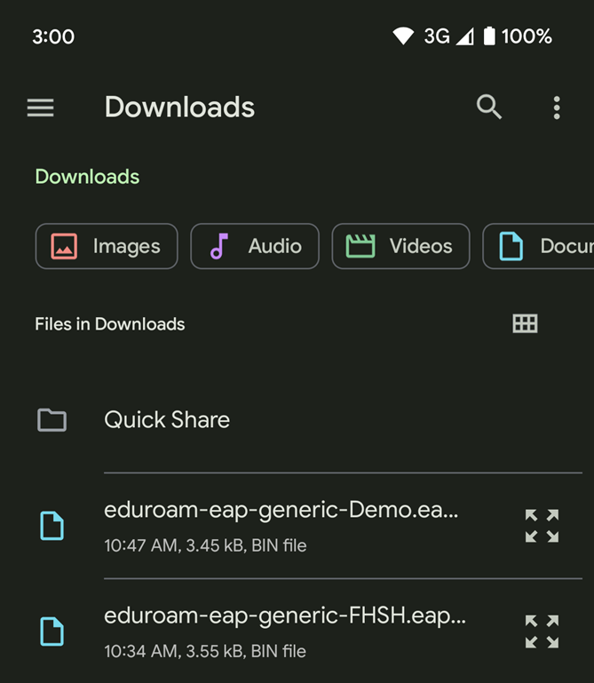
    6. 輸入你的帳號密碼，之後按下 Log in
    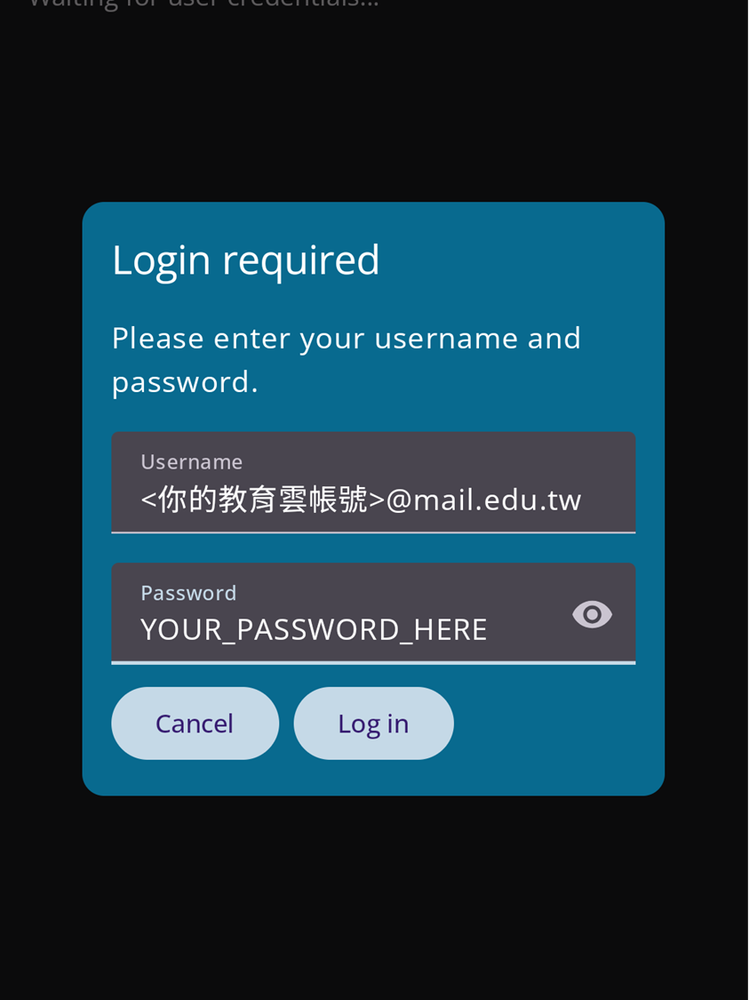
    7. 在跳出來是否儲存網路的選單中，選擇
    > Save
    > 確認
    > 儲存
    等字眼的選項
    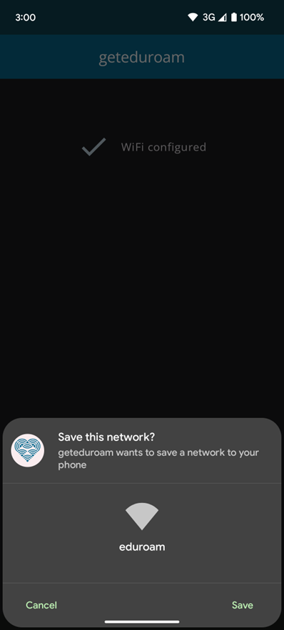

    </TabItem>
    <TabItem label="iOS" icon="apple">
    ## iOS
    0. 下載設定檔
    1. 下載 geteduroam 程式
    2. 打開他
    
    3. 長按右上搜尋鍵
    4. 點選 Open .eapconfig file
    
    5. 打開剛剛下載的設定檔檔案
    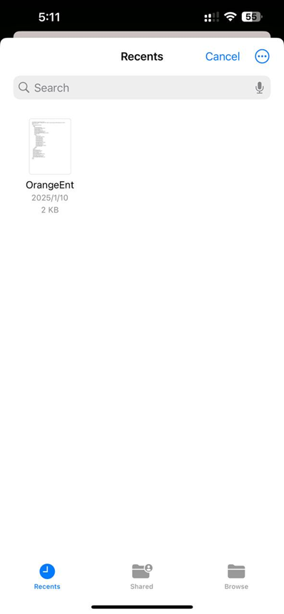
    6. 輸入你的帳號密碼，之後按下 Log in
    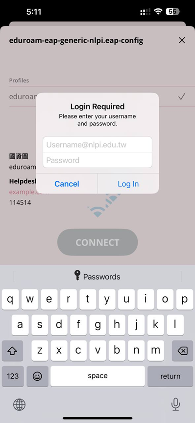

    </TabItem>
    <TabItem label="Linux" icon="linux">
    ## Linux
    https://github.com/geteduroam/linux-app/releases  
    都用 Linux 不會這點小事都解決不了吧？
    </TabItem>
</Tabs>