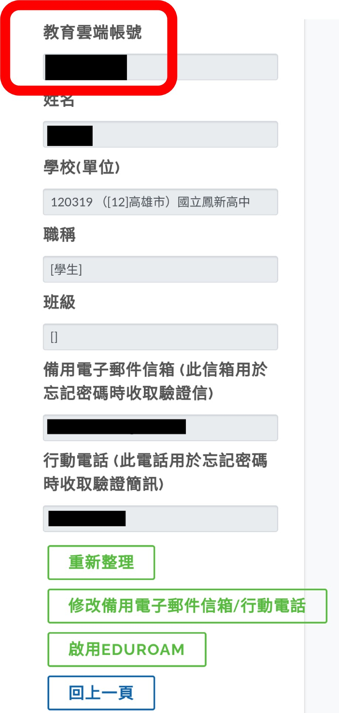
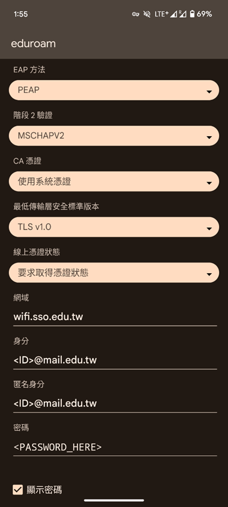
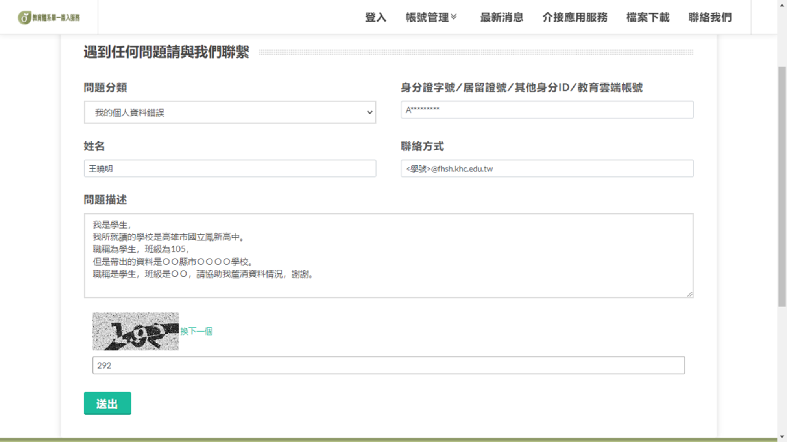

轉自 [這裡](https://neko70.net/eduroam_1/)
# 帳號申請
## 教育雲

> 學生、教職員可使用<br>

**(注意！！請勿使用縣市帳號認證)**<br>
### 一、申請教育雲帳號
- 之前未使用過 (新申辦)
  
  1. 首先，打開瀏覽器，進入以下網址 <https://www.sso.edu.tw/register>
  2. 依據網頁指示進行申辦

- 已使用過，但忘記帳號/密碼
  - 忘記帳號：<https://www.sso.edu.tw/forgetaccount><br>
  - 忘記密碼：<https://www.sso.edu.tw/resetpwd><br>
  - 啟用帳號：<https://www.sso.edu.tw/activateaccount><br>
    (顯示帳號已停用時使用)<br>

### 二、啟用 eduroam 存取權
進入 <https://www.sso.edu.tw/userinfo> ，登入你的帳號<br>
你應該會看到下圖的畫面，在這個畫面，請注意兩點：<br>

1. 下方有沒有出現eduroam
2. 你的學校單位是否正確
   
> 如果沒有出現eduroam且學校資料不正確，請參閱附件內容提出資料修改。<br>

**接著請看到下面的按鈕：**

- 如果你是看到「啟用EDUROAM」
  1. 點選「啟用EDUROAM」
  2. 點入「修改備用電子郵件信箱/行動電話」
  3. 點選儲存，之後進行下個步驟。
- 如果你是看到「EDUROAM已啟用」
  - 請直接進行下個步驟。

> 注意：請紀錄你的教育雲端帳號(如下圖紅框處)和你的登入密碼。

<br>

### 三、登入資訊
> [geteduroam 設定檔下載](https://download.isli.me/api/raw?path=/eduroam-eap-generic-TWEdu-tested.eap-config)<br>
> 帳號：`<你的 ID>@mail.edu.tw`<br>
> 密碼：`<教育雲密碼>`<br>
> 手動設定：<br>
> 

### 四、資料錯誤修正參考
- 已登入，但學校別並非你的學校
  - 請依據以下圖片填入資料，之後送出。 (PS：建議電子郵件填學校的)。<br>
    <br>
  - 等到回信後，(注意寄件者應為 oidcservice@mail.edu.tw)，依信件指示辦理，如果完成應該會寄出「已更新您現在任職單位」的信件，即可繼續下一步驟。
  - 問題描述參考：
    ```
    我是學生，
    我所就讀的學校是音擊市奏坂學園。
    職稱為學生，班級為114，
    但是帶出的資料是春日市國立母雞卡高中。
    職稱是學生，班級是514，請協助我釐清資料情況，謝謝。
    ```
## 國資圖
### 一、申請國資圖數位借閱證
- 之前未使用過 (新申辦)
  
  1. 首先，打開瀏覽器，進入以下網址 <https://www.nlpi.edu.tw/ReaderService/LoanService/Collection01/Loan03.htm>
  2. 依據網頁指示進行申辦

- 已使用過，但忘記帳號/密碼
  - 忘記密碼：<https://ipac.nlpi.edu.tw/forgetpassword><br>
  - 登入帳號：<https://allpass.nlpi.edu.tw/#/signIn><br>
    (修改密碼時使用)<br>

### 二、登入資訊
> **僅 TANetRoaming 可使用**<br>
> 帳號：`<身分證>@nlpi.edu.tw`<br>
> 密碼：`<一證通整合密碼>`
<br>