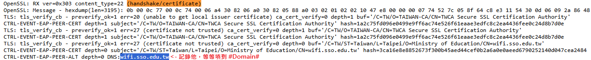
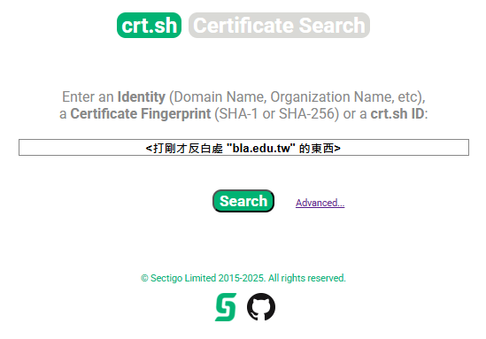
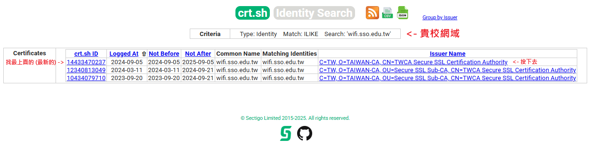
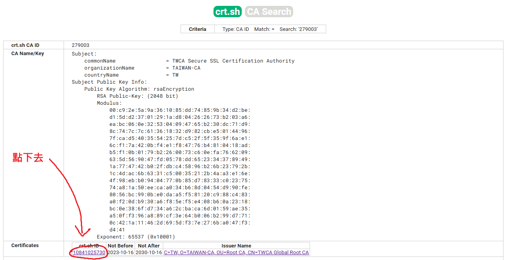
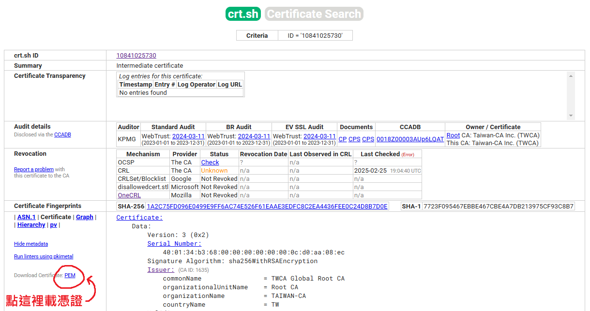
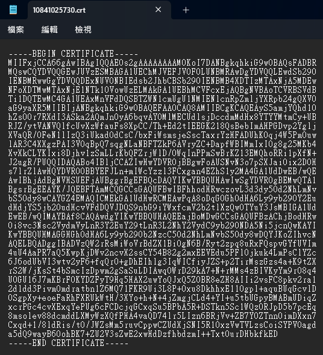

# 自行建立設定檔 
首先，先使用測試帳號或改過密碼的帳號 (資安緣故)，或 `anonymous@#Realm#`，去下面兩個站點 (擇一) 發起測試。 
- 中国科学技术大学 
  <https://eduroam.ustc.edu.cn/> 
- 中国西安科技大学 
  <http://eduroam.seesea.site/> 

之後，根據回傳的資訊，決定要使用哪一個模板： 
- 僅 PEAP-MSCHAPv2 成功：`eduroam-eap-generic-anonymous-PEAP-MSCHAPv2.eap-config`
- 僅 TTLS-PAP 成功：`eduroam-eap-generic-anonymous-TTLS-PAP.eap-config`
- 兩者都成功：`eduroam-eap-generic-anonymous-Both.eap-config`
- 兩者都失敗：先檢查密碼，或稍後再試，也有可能貴校不支援以上兩種驗證方式。

接著，請在網頁回傳的 log 中，尋找 `(handshake/certificate)`，紀錄 CA 憑證與其 DNS 值。

最後，取代模板以下部分的值 (用文字編輯器取代功能)。

- `#Domain#` -> 用最後的 DNS 值取代。 
- `#Realm#` -> 你登入帳號 @ 後面那串 (如 mail.edu.tw)，不須包含 @。 
- `#Name#` -> 學校名稱。 
- `#Email#` -> 學校管理單位 Email。 
- `#URL#` -> 學校管理單位 URL。 
- `#TEL#` -> 學校管理單位電話。 
- `#Cert#` -> Base64 格式的 CA 憑證 
  - 可以去上面的 CA Cert 資料夾找，有附上常見的根憑證。 
  - 或者如果學校是自簽憑證，去學校那邊載。 
  - 如果不是自簽憑證，可以去 https://crt.sh/ 找，只要不是自簽憑證都找的到，可以從 Certificate Transparency 反追 CA，操作如下圖。 
     
     
     
     
     
  - 把 `-----BEGIN CERTIFICATE-----` 和 `-----END CERTIFICATE-----` 還有換行 (Enter 打出來那東西) 都刪掉，讓他變成只有一行，之後填去 `#Cert#`