## 前言
在臺灣，部分單位依舊使用 GTC 作為內部驗證的方式。然而，直到 Windows 11，微軟並未原生支援這個認證方式。
因此，要在 Windows 下使用，你需要安裝 Plugin。
目前主要有兩個插件可供使用，一個是由 Aruba 開發的 EAP-GTC，另一個是由 Cisco 開發的 Cisco:PEAP。
接下來，將會特別詳述這兩個 Plugin 的使用方式。

## 下載
- Aruba EAP-GTC
    - [HPE Aruba](https://networkingsupport.hpe.com/downloads/software/RmlsZTo4N2FlMjE3ZS01NWUyLTExZWItYjM5Ni01ZmMzMWE3Y2ZkZWE%3D)
    - 需登入 HPE 帳號 (免費申請)
        - 請使用你的學校電子郵件註冊
        - 不可使用公共電子郵件服務 (如 Gmail, Outlook 等) 註冊
- Cisco PEAP
    - [網路時光機備份](https://web.archive.org/web/20200803205214if_/https://download.microsoft.com/download/8/2/E/82EEFB07-1AB3-4557-B654-B34D64C9DD94/Cisco_EAP_Supplicant_Installer_v1.zip)
    - [微軟官方來源 (已失效)](https://www.microsoft.com/en-us/download/details.aspx?id=46703)
    - [微軟官方下載 (已失效)](https://download.microsoft.com/download/8/2/E/82EEFB07-1AB3-4557-B654-B34D64C9DD94/Cisco_EAP_Supplicant_Installer_v1.zip)
## Aruba EAP-GTC
1. 點選設定新的連線及網路
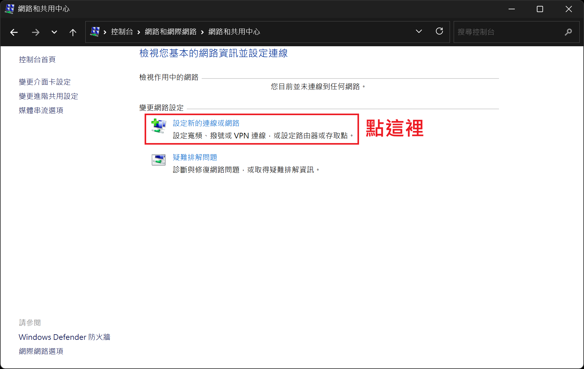
2. 點選手動連線到無線網路
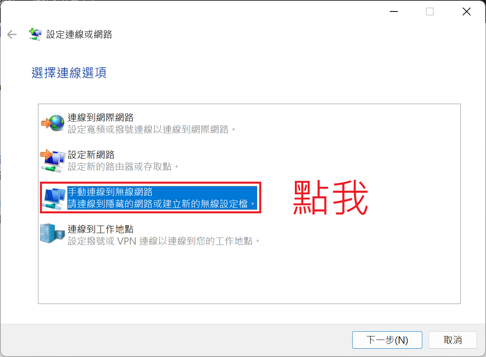
3. 請在網路名稱中，輸入 eduroam，安全性類型設定為 WPA2-Enterprise，之後點選下一步
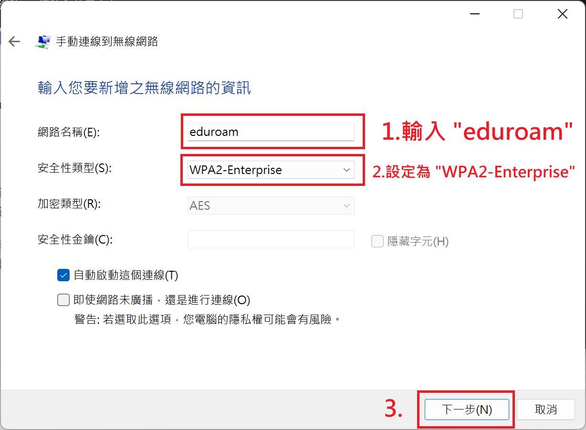
4. 點選"變更連線設定"(絕對不要按關閉)
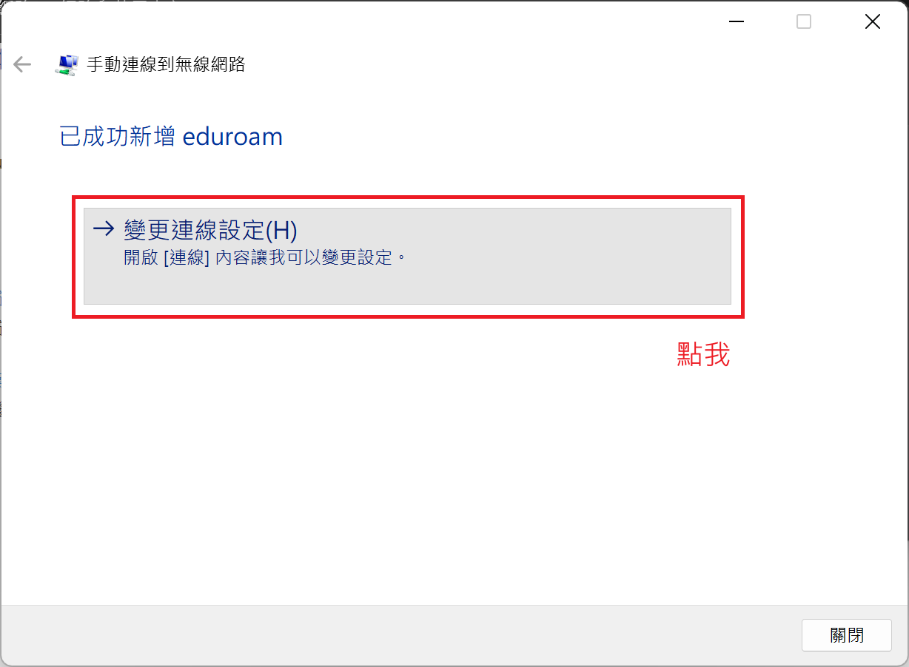
5. 在跳出的新視窗中，點選"安全性"分頁，然後在安全性分頁中，先確認"選擇網路驗證方法"是否選擇"Microsoft: Protected EAP (PEAP)"，然後點選紅框右方的設定。
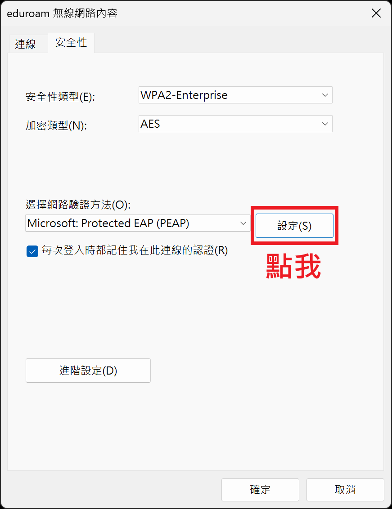
6. 在跳出來的新視窗中，取消勾選下圖上方紅框中的兩個勾取框，並且在下方"選擇驗證方法"中，選擇 "EAP-Token"，之後按下確定。
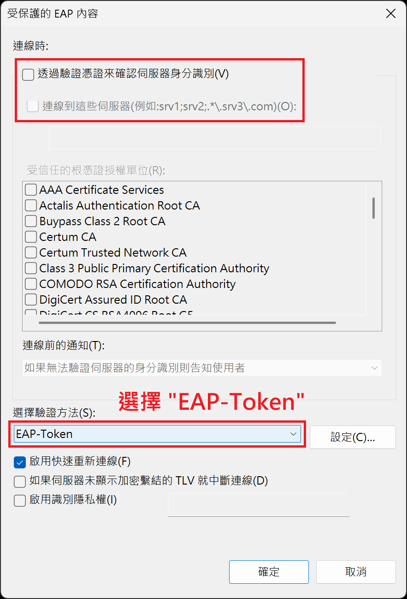
> 選項解釋：
> - 透過驗證憑證來確認伺服器身分識別
>   - 取消勾選會有資安風險 (密碼洩漏風險)，請小心使用。
>   - 但勾選了你可能連不上網路。
>   - 請叫你網管去你單位的 FreeRADIUS 裝 TTLS-PAP 的支援模組。
>   - 去 * 的 EAP-PEAP-GTC
> - 啟用識別隱私權:
>   - 也可勾選，並填寫為 `anonymous@<Realm>`
>   - 如：`anonymous@mail.edu.tw`
7. 按下確定，關閉
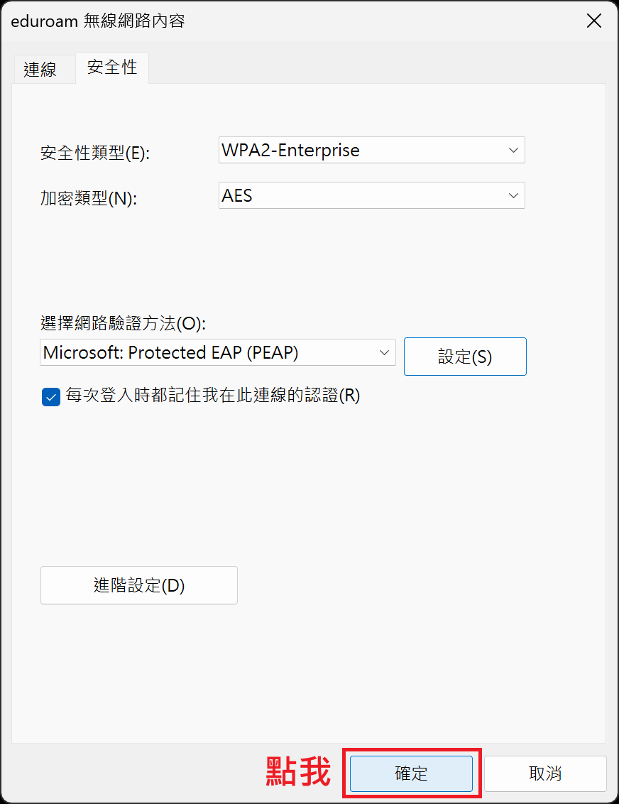
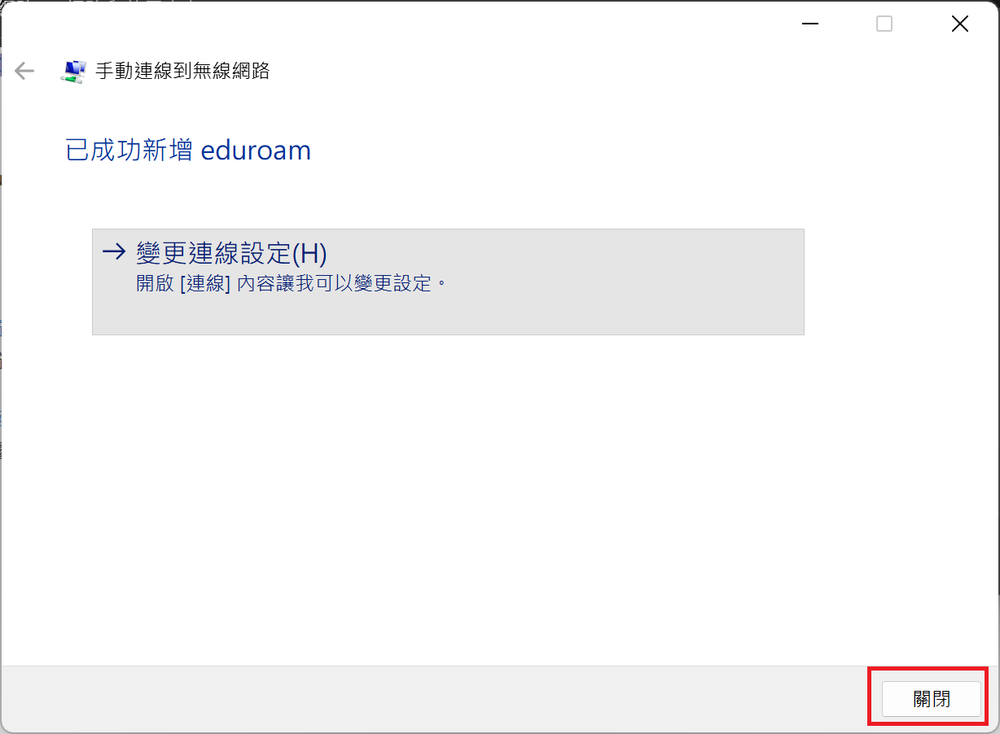
8. 請依照右圖內容輸入你的帳號密碼
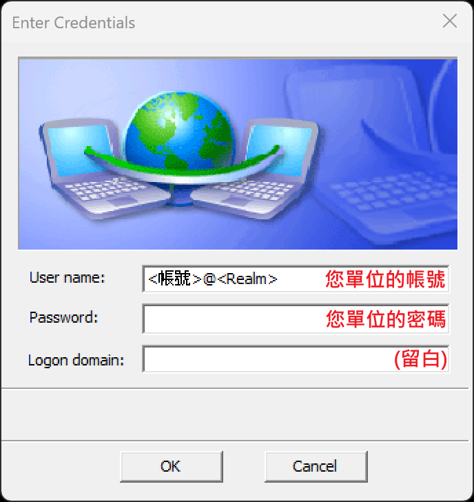

## Cisco PEAP
1. 點選設定新的連線及網路

2. 點選手動連線到無線網路

3. 請在網路名稱中，輸入 eduroam，安全性類型設定為 WPA2-Enterprise，之後點選下一步

4. 點選"變更連線設定"(絕對不要按關閉)

5. 在跳出的新視窗中，點選"安全性"分頁，然後在安全性分頁中，先在"選擇網路驗證方法"(紅框)中，選擇"Cisco: PEAP"，然後點選紅框右方的設定。
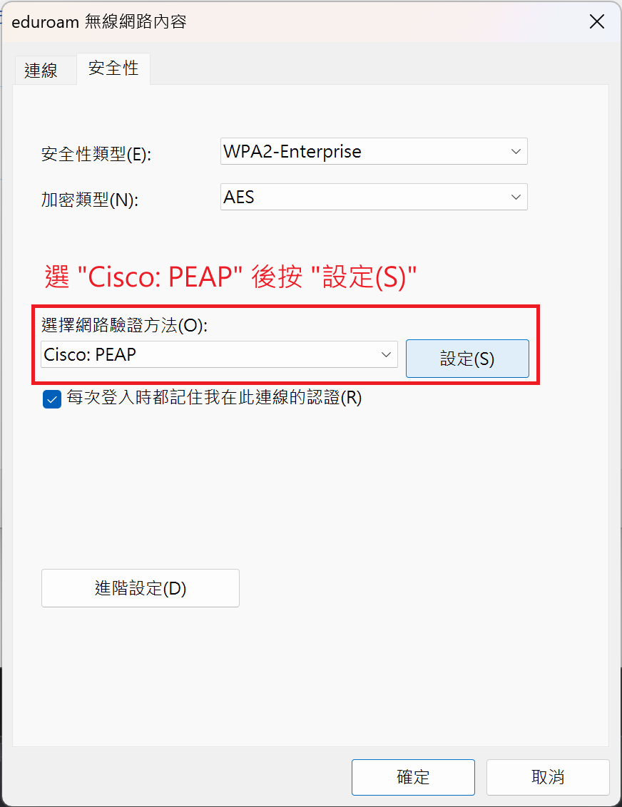
6. 在跳出來的新視窗中，取消勾選下圖紅框中的兩個勾取框。
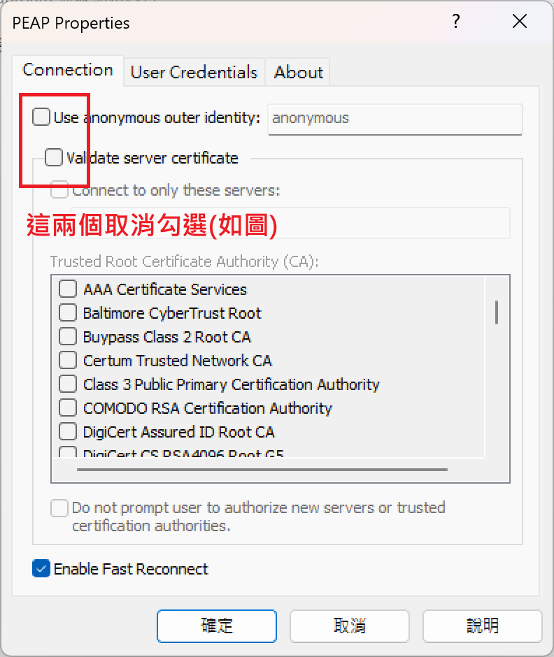
> 選項解釋：
> - Use anonymous outer identity:
>    - 也可勾選，並填寫為 `anonymous@<Realm>`
>   - 如：`anonymous@mail.edu.tw`
> - Validate server certificate
>   - 取消勾選會有資安風險 (密碼洩漏風險)，請小心使用。
>   - 但勾選了你可能連不上網路。
>   - 請叫你網管去你單位的 FreeRADIUS 裝TTLS-PAP 的支援模組。
>   - 去 * 的 EAP-PEAP-GTC
7. 請依照右圖內容輸入你的帳號密碼
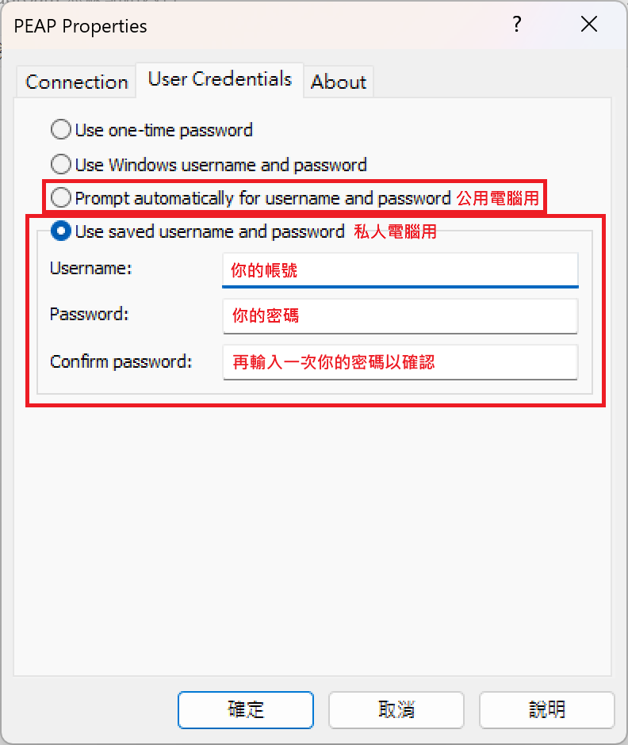
> - 上方為公用電腦設定，不會記錄帳號密碼
> - 下方為私人電腦設定，會記錄帳號密碼
8. 按下確定，確定，關閉
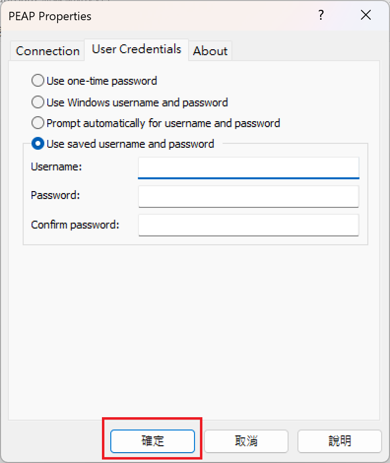
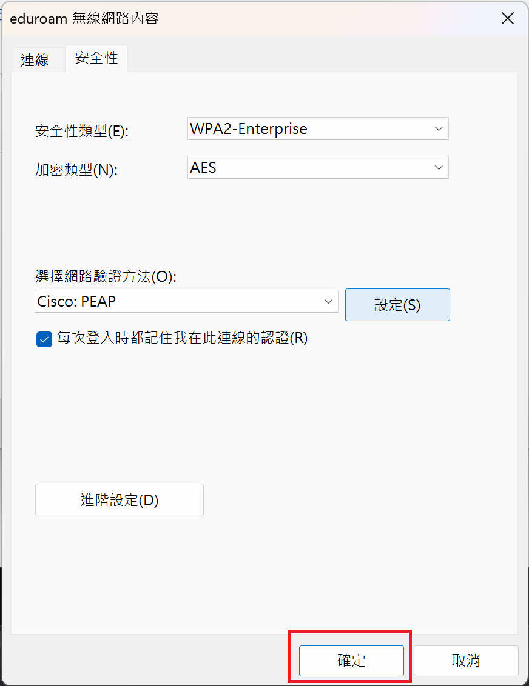
