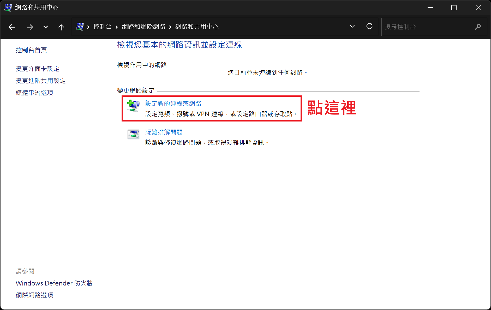
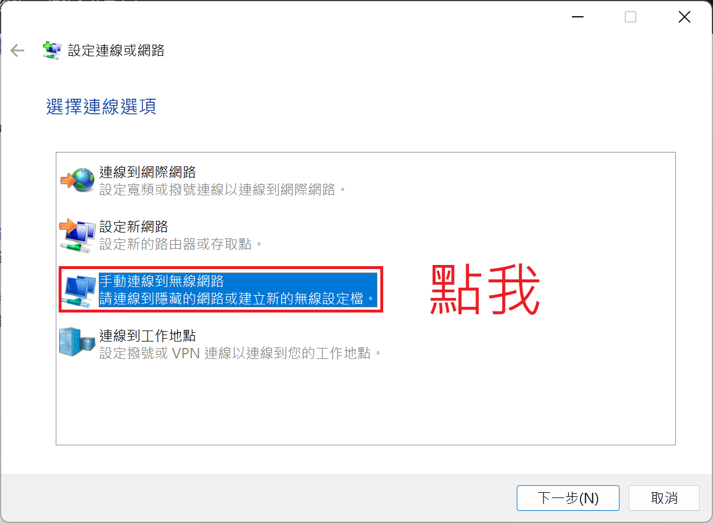
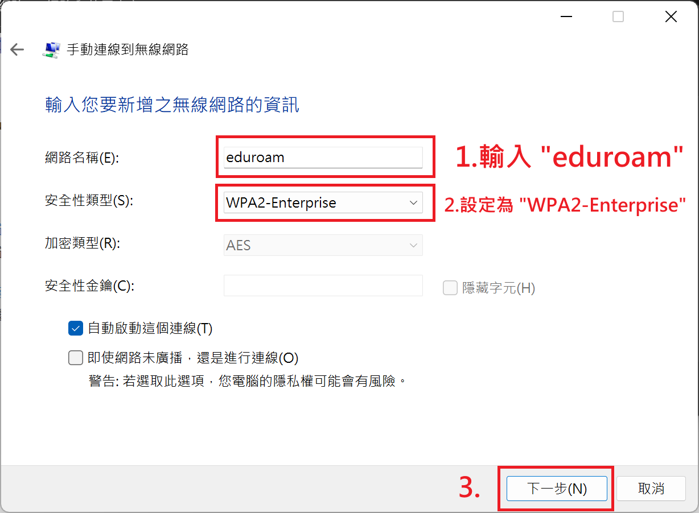
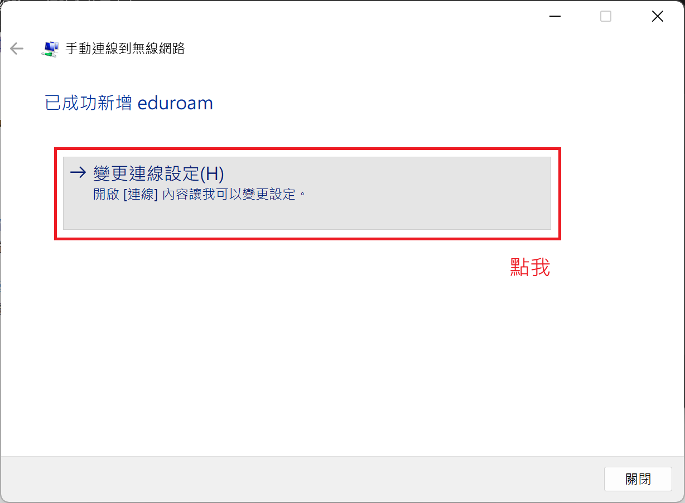

## 前言
Windows 使用 TTLS-PAP 需要手動設定，請參閱下方步驟設定。

1. 點選設定新的連線及網路

2. 點選手動連線到無線網路

3. 請在網路名稱中，輸入 eduroam，安全性類型設定為 WPA2-Enterprise，之後點選下一步

4. 點選"變更連線設定"(絕對不要按關閉)

5. 在跳出的新視窗中，點選"安全性"分頁，然後在安全性分頁中，把"選擇網路驗證方法"更改為"Microsoft: EAP-TTLS"。

6. 然後點選紅框右方的設定。

7. 在跳出來的新視窗中，先勾選下圖上方紅框中的"啟用識別隱私權"，並且在下方填入 anonymous@<你登入帳號 @ 後面那串內容>，之後按下確定。

8. 按下確定，關閉

9. 請依照右圖內容輸入你的帳號密碼

10. 請檢視憑證詳細資料是否正確(各單位不同，附圖為教育雲)，否則，你的帳號密碼可能會外洩。
