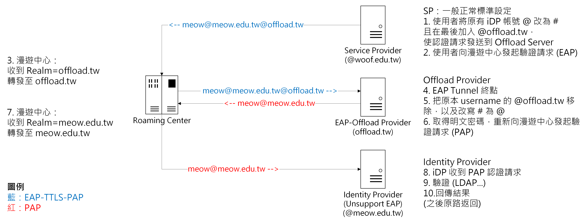
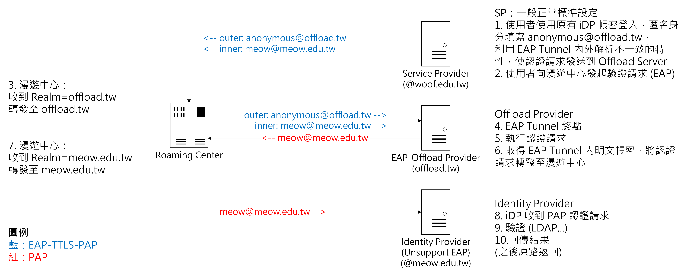

**內部實驗中，未來將可以使不支援 EAP 認證的 IdP 可使用 eduroam 服務。**

import { Aside, Badge, LinkButton } from '@astrojs/starlight/components';

<LinkButton
  href="/offload"
  icon="download"
  iconPlacement="start"
>
  設定檔下載 <Badge text="開發中" variant="tip" />
</LinkButton>
<LinkButton
  href="#%E5%8E%9F%E7%90%86"
  variant="secondary"
  icon="document"
  iconPlacement="start"
>
  原理說明
</LinkButton>

## 原理
### 核心邏輯
將認證請求先發送到特製伺服器，該伺服器解出 EAP 通道內部內容，再二次轉發到原始伺服器做認證。
### 路由導向
有兩種方法：

1. 改寫帳號
2. 利用 EAP 隧道內外解析不一致特性 (匿名身分) 實現定向路由

改寫帳號的原理很簡單，使用者裝置設定時，把原本帳號的 @ 改成其他替代字元，並在帳號結尾加入特製伺服器的 Realm，使他的請求會轉送給特製伺服器。  
特製伺服器收到認證請求後，將收到的帳號改寫回使用者原本的帳號，再發出即可，如附圖。  

而解釋 EAP 隧道解析不一致，則需要先提及匿名身分的原理。  
由於 EAP 隧道內的帳密傳輸，受到 TLS 加密，因此中間轉發的 RADIUS 皆無法得知隧道內的帳密。因此，為了轉發路由等需求，EAP 規範了匿名身分的存在。  
其運作原理是在 EAP 隧道外以明文傳送一個身分(帳號)，這個身分(帳號)不參與認證過程，僅作為中間 RADIUS 識別用。  
而 eduroam Proxy 過程也依賴這個值的內容決定要轉發到哪個單位的伺服器。  
因此，我們可以做到內部與外部填寫不一樣 Realm 的帳號，來達成定向路由的結果，如附圖。  

### 問題與解法
#### 認證紀錄問題
而以上兩種方式，皆會在骨幹產生兩筆不同的認證方式，尤其是法 2，由於利用了匿名身分，骨幹並無法直接得知這筆認證請求是由哪個帳號送出請求。  
因此，需要確保該特製伺服器的認證 log 可以被妥善儲存。  
#### Blast!RADIUS (CVE-2024-3596) 問題
由於第二段 (PAP) 段無使用 EAP 保護，因此易受到 Blast!RADIUS 影響，請務必套用緩解措施。 [FreeRADIUS](https://www.freeradius.org/vul_notifications/2024/07/09/blastradius.html) [Cisco](https://www.cisco.com/c/zh_tw/support/docs/security/identity-services-engine/222287-blast-radius-cve-2024-3596-protocol-sp.html)
